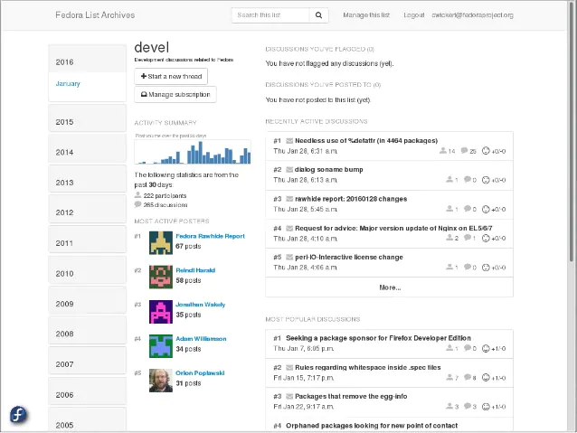

<!--
NB: Deze README is automatisch gegenereerd door <https://github.com/YunoHost/apps/tree/master/tools/readme_generator>
Hij mag NIET handmatig aangepast worden.
-->

# Mailman3 voor Yunohost

[](https://ci-apps.yunohost.org/ci/apps/mailman3/)


[](https://install-app.yunohost.org/?app=mailman3)

*[Deze README in een andere taal lezen.](./ALL_README.md)*

> *Met dit pakket kun je Mailman3 snel en eenvoudig op een YunoHost-server installeren.*  
> *Als je nog geen YunoHost hebt, lees dan [de installatiehandleiding](https://yunohost.org/install), om te zien hoe je 'm installeert.*

## Overzicht

* Users can just sign up themselves to manage details
* Users can use mailing lists without signing up?

## Limitations

* Migrating from Mailman 2.X is not officially supported, sorry. However, there is a manual and
  which details an experimental process. Please see [the documentation](https://docs.mailman3.org/en/latest/migration.html).

* Mailman3 must be configured to use a root domain (https://myyunohost.org and *not* https://myyunohost.org/mailman3).

* You must have a HTTPS certificate installed on the root domain.

* There may be only one installation per YunoHost.


**Geleverde versie:** 3.3~ynh1

**Demo:** <https://lists.mailman3.org/mailman3/lists/>

## Schermafdrukken



## Documentatie en bronnen

- Officiele website van de app: <http://www.list.org/>
- Officiele gebruikersdocumentatie: <http://docs.mailman3.org/en/latest/userguide.html>
- Officiele beheerdersdocumentatie: <https://docs.mailman3.org/en/latest/>
- Upstream app codedepot: <https://gitlab.com/mailman/mailman-suite>
- YunoHost-store: <https://apps.yunohost.org/app/mailman3>
- Meld een bug: <https://github.com/YunoHost-Apps/mailman3_ynh/issues>

## Ontwikkelaarsinformatie

Stuur je pull request alsjeblieft naar de [`testing`-branch](https://github.com/YunoHost-Apps/mailman3_ynh/tree/testing).

Om de `testing`-branch uit te proberen, ga als volgt te werk:

```bash
sudo yunohost app install https://github.com/YunoHost-Apps/mailman3_ynh/tree/testing --debug
of
sudo yunohost app upgrade mailman3 -u https://github.com/YunoHost-Apps/mailman3_ynh/tree/testing --debug
```

**Verdere informatie over app-packaging:** <https://yunohost.org/packaging_apps>
