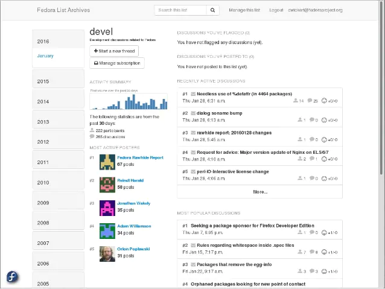

<!--
Важно: этот README был автоматически сгенерирован <https://github.com/YunoHost/apps/tree/master/tools/readme_generator>
Он НЕ ДОЛЖЕН редактироваться вручную.
-->

# Mailman3 для YunoHost

[](https://ci-apps.yunohost.org/ci/apps/mailman3/)


[](https://install-app.yunohost.org/?app=mailman3)

*[Прочтите этот README на других языках.](./ALL_README.md)*

> *Этот пакет позволяет Вам установить Mailman3 быстро и просто на YunoHost-сервер.*  
> *Если у Вас нет YunoHost, пожалуйста, посмотрите [инструкцию](https://yunohost.org/install), чтобы узнать, как установить его.*

## Обзор

* Users can just sign up themselves to manage details
* Users can use mailing lists without signing up?

## Limitations

* Migrating from Mailman 2.X is not officially supported, sorry. However, there is a manual and
  which details an experimental process. Please see [the documentation](https://docs.mailman3.org/en/latest/migration.html).

* Mailman3 must be configured to use a root domain (https://myyunohost.org and *not* https://myyunohost.org/mailman3).

* You must have a HTTPS certificate installed on the root domain.

* There may be only one installation per YunoHost.


**Поставляемая версия:** 3.3~ynh1

**Демо-версия:** <https://lists.mailman3.org/mailman3/lists/>

## Снимки экрана



## Документация и ресурсы

- Официальный веб-сайт приложения: <http://www.list.org/>
- Официальная документация пользователя: <http://docs.mailman3.org/en/latest/userguide.html>
- Официальная документация администратора: <https://docs.mailman3.org/en/latest/>
- Репозиторий кода главной ветки приложения: <https://gitlab.com/mailman/mailman-suite>
- Магазин YunoHost: <https://apps.yunohost.org/app/mailman3>
- Сообщите об ошибке: <https://github.com/YunoHost-Apps/mailman3_ynh/issues>

## Информация для разработчиков

Пришлите Ваш запрос на слияние в [ветку `testing`](https://github.com/YunoHost-Apps/mailman3_ynh/tree/testing).

Чтобы попробовать ветку `testing`, пожалуйста, сделайте что-то вроде этого:

```bash
sudo yunohost app install https://github.com/YunoHost-Apps/mailman3_ynh/tree/testing --debug
или
sudo yunohost app upgrade mailman3 -u https://github.com/YunoHost-Apps/mailman3_ynh/tree/testing --debug
```

**Больше информации о пакетировании приложений:** <https://yunohost.org/packaging_apps>
